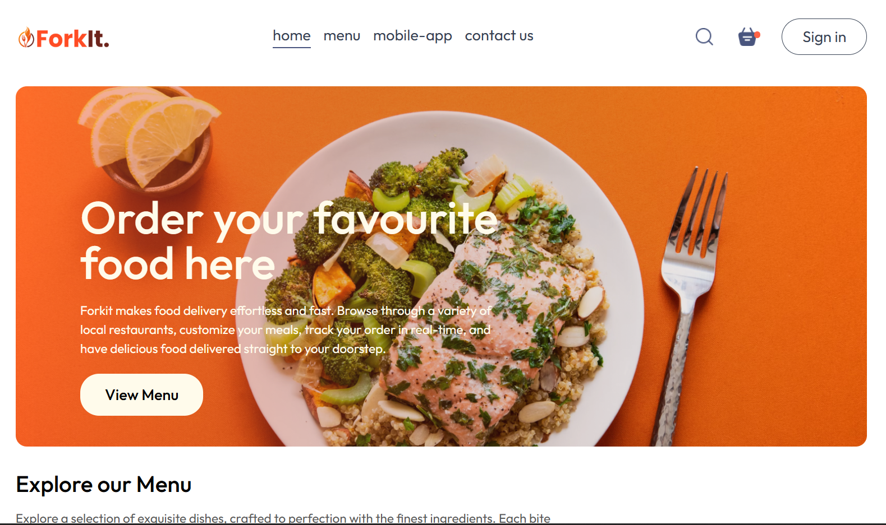
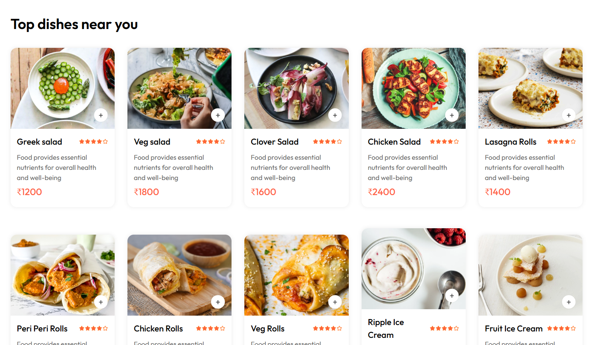

  

# ForkIt: Fast. Fresh. Forkin’ Good.

A simple and responsive food delivery web app built with **React JS**. Users can browse menus, add items to cart, and place orders.

## 🚀 Features

- 🔄 React Router for multi-page navigation  
- 💨 Tailwind CSS for fast styling  
- 📦 Context API for global state management (Cart, Food List)   
- 🛒 Add to Cart with interactive buttons  
- 📱 Responsive design  
- 🔐 Sign In / Sign Up  
- 📦 Cart and Place Order pages  

## 📁 Folder Structure

- `components/` – Navbar, Header, FoodItem, FoodDisplay, Footer  
- `pages/` – Home, Cart, SignIn, SignUp, PlaceOrder  
- `assets/` – Food images and data  
- `context/` – StoreContextProvider for managing global state  

## 🛠 Tech Stack

- React JS  
- React Router DOM  
- Tailwind CSS  
- Context API  

## 🧰 Setup Instructions

1. Clone the repo  
2. Open `frontend/` folder in VS Code  
3. Run `npm install`  
4. Start the app: `npm run dev`

## 🖼 Preview

  
  

